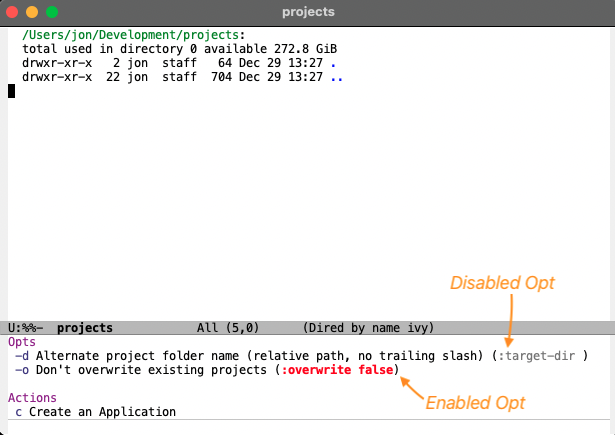

# emacs-deps-new

Elisp wrapper around [deps.new](https://github.com/seancorfield/deps-new) and [clj-new](https://github.com/seancorfield/clj-new). Create Clojure projects from templates within Emacs. 

# Installation

## Dependencies

You will need:

- A version of Clojure that includes [Clojure CLI Tools](https://github.com/clojure/tools.deps.alpha) (comes included in any recent version)
- [deps-new](https://github.com/seancorfield/deps-new) available on your system
- [clj-new](https://github.com/seancorfield/clj-new) available on your system. 

`deps-new` and `clj-new` can be installed with the following commands:

`clojure -Ttools install io.github.seancorfield/deps-new '{:git/tag "v0.4.9"}' :as new`

`clojure -Ttools install com.github.seancorfield/clj-new '{:git/tag "v1.2.381"}' :as clj-new`

## MELPA 

- Run `M-x package-install clj-deps-new`
- If the package wasn't found, run `M-x package-refresh-contents`
- Place `(require 'clj-deps-new)` in your init file

## Manual Installation

- Run `git clone https://github.com/jpe90/emacs-deps-new.git`
- In emacs, run `package-install-file` and navigate to `clj-deps-new.el`
- Place `(require 'clj-deps-new)` in your init file

# Usage

Run `M-x clj-deps-new` and follow the on-screen prompts to create a project. 
When opts are enabled, the text in parenthesis display a preview of the argument that will be passed to the final command.

# Preview

# Community Templates

This project includes some useful templates provided by the community. If you have a template that you think would be useful for others, feel free to submit a PR with additional transients or submit an issue with a link to the template.

# Extending

See the `Community Templates` section of q`clj-deps-new.el` to see how to add new templates to the interface.

You may to familiarize yourself with the basics of Transient. The [Developer Quick Start Manual](https://github.com/magit/transient/wiki/Developer-Quick-Start-Guide) and [Transient Manual](https://magit.vc/manual/transient.html#Defining-New-Commands) are good places to get started. In particular, note the section on [modifying existing transients](https://magit.vc/manual/transient.html#Modifying-Existing-Transients). 
